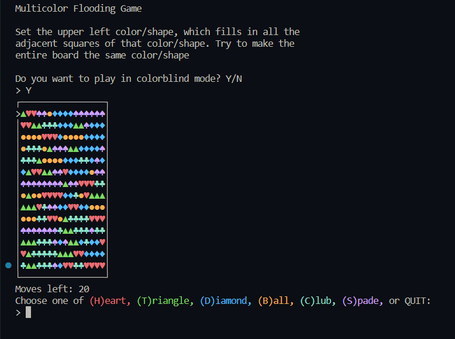

# Multicolor Flooding Game

Embark on an exciting journey of color and strategy with the Multicolor Flooding Game program. Dive into the challenge of filling the game board with a single color by strategically changing the color of the element in the upper left corner. As you extend your color across adjacent squares of the same original color, conquer the board one step at a time. Similar to the smartphone game "Flood It!", this program offers a captivating gaming experience that will test your strategic thinking and color-matching skills.

## How to Play

1. Run the program in a compatible environment.
2. Choose your preferred game mode: standard color mode or color-blind mode with geometric shapes.
3. Select colors or shapes to flood the game board, changing adjacent elements to match.
4. Strive to fill the entire board with a single color or shape in the fewest moves possible.

## Features

- Engage in a captivating multicolor flooding game with strategic gameplay.
- Test your color-matching skills and strategic thinking to conquer the game board.
- Experience both standard color mode and a color-blind mode with geometric shapes.

## Instructions

1. Open a terminal or command prompt.
2. Navigate to the program's directory.
3. Run the program using `python multicolor_flooding_game.py`.
4. Select your preferred game mode and colors/shapes to fill the board.

## Sample Output

## Note

The Multicolor Flooding Game offers a stimulating challenge that requires both strategic planning and color-matching prowess. As you work to conquer the game board, remember that each move brings you closer to victory.
